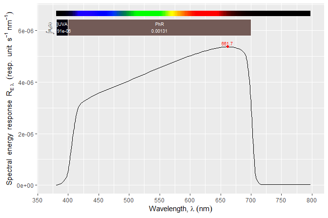

# photobiologySensors 

<!-- badges: start -->

[](https://cran.r-project.org/package=photobiologySensors)
[](https://cran.r-project.org/web/checks/check_results_photobiology.html)
[](https://aphalo.r-universe.dev/photobiologySensors)
[](https://github.com/aphalo/photobiologySensors/actions)
[](https://docs.r4photobiology.info/photobiologySensors/)
[](https://doi.org/10.32614/CRAN.package.photobiologySensors)
<!-- badges: end -->

Package **photobiologySensors** is a collection of spectral
responsiveness data for different broadband sensors and of angular
response data for some of the same sensors and for cosine diffusers and
other entrance optics used with spectrometers. It complements other
packages in the suite of R packages for photobiology ‘r4photobiology’.
This package contains only data.

## Examples

``` r
library(photobiologySensors)
eval_ggspectra <- requireNamespace("ggspectra", quietly = TRUE)
if (eval_ggspectra) library(ggspectra)
```

How many spectra are included in the current version of
‘photobiologyFilters’?

``` r
length(sensors.mspct)
#> [1] 55
```

What are the names of available spectra? We use `head()` to limit the
output.

``` r
# list names of the first 10 sensors
head(names(sensors.mspct), 10)
#>  [1] "ams_AS7331"          "ams_AS7341"          "ams_AS7343"         
#>  [4] "ams_TSL2591"         "Vishay_VEML6075"     "ams_TSL254R"        
#>  [7] "ams_TSL257"          "Analytik_Jena_UVX25" "Analytik_Jena_UVX31"
#> [10] "Analytik_Jena_UVX36"
```

To subset based on different criteria we can use predefined character
vectors of filter names. For example, vector `licor_sensors` lists the
names of the spectra for sensors from LI-COR.

``` r
kipp_sensors
#> [1] "KIPP_CUV_5" "KIPP_PQS1"  "KIPP_UVS_A" "KIPP_UVS_B" "KIPP_UVS_E"
```

We can use the vector to extract all these spectra as a collection, or
as show below, extract data for PAR sensors from Kipp.

``` r
sensors.mspct[intersect(kipp_sensors, par_sensors)]
#> Object: response_mspct [1 x 1]
#> --- Member: KIPP_PQS1 ---
#> Object: response_spct [202 x 2]
#> Wavelength range 391.431-717.608 nm, step 0.5010399-4.00832 nm 
#> Label: KIPP PQS1 light sensor 
#> Variables:
#>  w.length: Wavelength [nm]
#>  s.e.response: Spectral energy response [W-1 m2 nm] 
#> --
#> # A tibble: 202 × 2
#>    w.length s.e.response
#>       <dbl>        <dbl>
#>  1     391.       0.0245
#>  2     392.       0.0327
#>  3     392.       0.0410
#>  4     393.       0.0561
#>  5     394.       0.0650
#>  6     394.       0.0753
#>  7     395.       0.0960
#>  8     396.       0.119 
#>  9     397.       0.134 
#> 10     397.       0.153 
#> # ℹ 192 more rows
#> 
#> --- END ---
```

Please, see the *User Guide* or help pages for the names of other
vectors of names by supplier, wavelength region and of the spectrum.
Summary calculations can be easily done with methods from package
‘photobiology’. Here we calculate mean photon response for two regions
of the spectrum delimited by wavelengths in nanometres. Roughly 99% of
the photons sensed by this sensor are within PAR.

``` r
q_response(sensors.mspct[["LICOR_LI_190R"]], 
           list(waveband(c(400, 700)), waveband(c(700, 800))),
           quantity = "contribution")
#>  R/Rtot[/q]_range.400.700 R/Rtot[/q]_range.700.800[ 
#>                0.98821737                0.00870119 
#> attr(,"time.unit")
#> [1] "second"
#> attr(,"radiation.unit")
#> [1] "contribution photon response"
```

The `autoplot()` methods from package ‘ggspectra’ can be used for
plotting one or more spectra at a time. The classes of the objects used
to store the spectral data are derived from `"data.frame"` making direct
use of the data easy with functions and methods from base R and various
packages.

``` r
autoplot(sensors.mspct[["LICOR_LI_190R"]])
```

<!-- -->

## Code breaking renaming of data objects in 2020

In the update to version 0.5.0 in October 2020 several members of the
collection of sensor-response spectra were renamed to ensure consistency
and clarity. As of version 0.5.0 all member names start with the name of
the manufacturer or supplier. In addition, several of the vectors of
names of member spectra were renamed to include the word “sensors” to
avoid possible name clashes with other packages and also to improve
naming consistency.

## Installation

Installation of the most recent stable version from CRAN:

``` r
install.packages("photobiologySensors")
```

Installation of the current unstable version from R-Universe CRAN-like
repository (synchronised with GitHub):

``` r
install.packages('photobiologySensors', 
                 repos = c('https://aphalo.r-universe.dev', 
                           'https://cloud.r-project.org'))
```

The two approaches above, automatically install dependencies.

Installation of the current unstable version from GitHub sources:

``` r
# install.packages("devtools")
devtools::install_github("aphalo/photobiologySensors")
```

Installation from GitHub sources does not automatically install
dependencies. Once package ‘photobiology’ is installed, installation of
the remaining or missing packages in the suite from CRAN (or by adding
the repository information as above, also from R-Universe):

``` r
intalled_pkgs <- installed.packages()[ , 1]
missing_pkgs <- setdiff(photobiology::r4p_pkgs, intalled_pkgs)
if (length(missing_pkgs) > 0) {
 install.packages(missing_pkgs)
}
```

## Documentation

HTML documentation is available at
(<https://docs.r4photobiology.info/photobiologySensors/>), including the
*User Guide*.

News on updates to the different packages of the ‘r4photobiology’ suite
are regularly posted at (<https://www.r4photobiology.info/>).

Two articles introduce the basic ideas behind the design of the suite
and describe its use: Aphalo P. J. (2015)
(<https://doi.org/10.19232/uv4pb.2015.1.14>) and Aphalo P. J. (2016)
(<https://doi.org/10.19232/uv4pb.2016.1.15>).

A book is under preparation, and the draft is currently available at
(<https://leanpub.com/r4photobiology/>).

A handbook written before the suite was developed contains useful
information on the quantification and manipulation of ultraviolet and
visible radiation: Aphalo, P. J., Albert, A., Björn, L. O., McLeod, A.
R., Robson, T. M., & Rosenqvist, E. (Eds.) (2012) Beyond the Visible: A
handbook of best practice in plant UV photobiology (1st ed., p. xxx +
174). Helsinki: University of Helsinki, Department of Biosciences,
Division of Plant Biology. ISBN 978-952-10-8363-1 (PDF),
978-952-10-8362-4 (paperback). PDF file available from
(<https://hdl.handle.net/10138/37558>).

## Contributing

Pull requests, bug reports, and feature requests are welcome at
(<https://github.com/aphalo/photobiologySensors>).

## Citation

If you use this package to produce scientific or commercial
publications, please cite according to:

``` r
citation("photobiologySensors")
#> To cite package ‘photobiologySensors’ in publications use:
#> 
#>   Aphalo, Pedro J. (2015) The r4photobiology suite. UV4Plants Bulletin,
#>   2015:1, 21-29. DOI:10.19232/uv4pb.2015.1.14
#> 
#> A BibTeX entry for LaTeX users is
#> 
#>   @Article{,
#>     author = {Pedro J. Aphalo},
#>     title = {The r4photobiology suite},
#>     journal = {UV4Plants Bulletin},
#>     volume = {2015},
#>     number = {1},
#>     pages = {21-29},
#>     year = {2015},
#>     doi = {10.19232/uv4pb.2015.1.14},
#>   }
```

## License

© 2012-2025 Pedro J. Aphalo (<pedro.aphalo@helsinki.fi>). Released under
the GPL, version 2 or greater. This software carries no warranty of any
kind.
